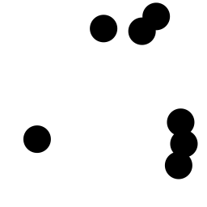

# polkaspots
Counting dots with deep learning

There’s a script file polkaspots.py that can generate images of a given resolution, containing a desired number of dots, of a specified size. Currently generated images are RGB. All dots (disks) in a given image are the same size, and dots are allowed to overlap but only up to half their diameter. This is like the "Rayleigh criterion", so dots should still be able to be distinguished even when they overlap. 

There’s also an iPython/Jupyter notebook starting on the process of training a DL model to output the number of dots in a given image. I want to play around with various architectures and assumptions, eventually.

The dataset contains 256x256 images which have dot radii ranging from 2 to 40, and numbers of dots ranging from 0 to 10. The image directories are zipped, one for each radius of dot. There's also a directory of dot positions which contain .csv files that list the center points of the dots in the corresponding image.
